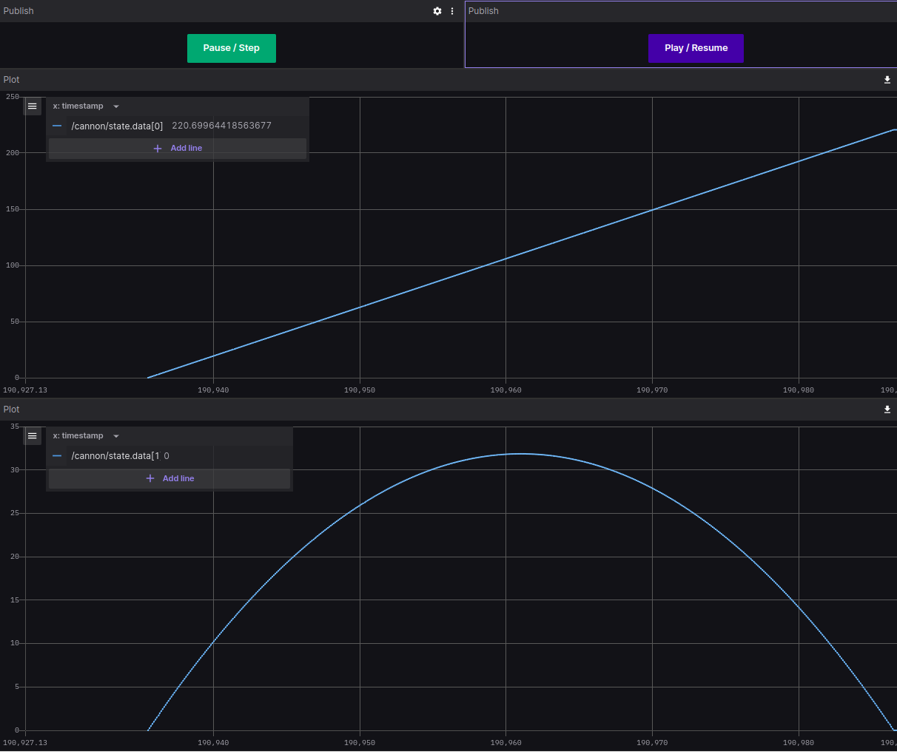

# Cannon

This project is a ROS implementation of the [cannonball simulation](https://nasa.github.io/trick/tutorial/ATutASimpleSim) provided by NASA Johnson Space Center as part of the tutorial for the 
[Trick Simulation Environment](https://nasa.github.io/trick/).

It determines the trajectory and time of impact of a cannon ball that is fired with an initial speed and initial angle, assuming a constant acceleration of gravity (g), and no aerodynamic forces.


Two versions of the simulation are provided: an analytic solution and a numeric integration solution.

# Prerequisites
You can either run inside *Docker* (with VSCode or manual) or on an *Ubuntu with ROS2 Humble* installed.

- [Foxglove](https://foxglove.dev/) (optional)

## Using *Docker* and/or VSCode:
- [Docker](https://www.docker.com/)
- [Visual Studio code](https://code.visualstudio.com/download) (optional)

## Using *Ubuntu with ROS2 Humble*:
We tested it on Ubuntu 22.04

- [CITROS CLI](https://citros.io/doc/docs_cli/overview/cli_install)
- [ROS2 Humble on Ubuntu](https://docs.ros.org/en/humble/Installation/Ubuntu-Install-Debians.html)
- ROS Humble Bridge installed: `sudo apt install -y ros-humble-rosbridge-suite ros-humble-rosbag2-storage-mcap`

# Installation
```bash
git clone git@github.com:citros-garden/cannon.git
cd cannon
```

## Using *Ubuntu with ROS2 Humble*:
Nothing to do add, you should be good to go.

## Using *Docker* directly:
```bash
docker build -t citros_cannon .
docker run -it citros_cannon /bin/bash
```

## Using *Docker* and VSCode:
```bash
code .
```
and open the repository inside a container using VScode's *reopen in container* option.

# Build 
```bash
colcon build
source install/local_setup.bash
```

# Run Simulation
Running either of the two simulations will result in the logger output being written to the console.

## Run the analytic solution in pure ROS
```bash
ros2 launch scheduler cannon_analytic.launch.py
```

## Run the numeric integration solution in pure ROS
```bash
ros2 launch scheduler cannon_numeric.launch.py
```

# Config CITROS

## Connected to CITROS Servers (optional)
```bash
citros login
```
The login will guide you through the whole setup process with SSH key exchange also.

## Init CITROS
```bash
citros init
```

## Run Simulation with CITROS locally
```bash
citros run -n "run_1" -m "first run"
```

## Run Simulation with CITROS remotely on CITROS servers
```bash
citros run -n "run_1" -m "first remote run" -r
```

## Implementation Overview
The project is made out of three ROS nodes - `cannon_analytic`, `cannon_numeric` and `scheduler`. The scheduler node is responsible for driving the simulation by publishing a `scheduler` topic at a given rate (say, 100Hz). The cannon nodes subscribe to this topic, and upon receiving it perform a single calculation step. The rate (`dt`) is a ROS parameter for the scheduler node, which means you may change its value in the `config/params.yaml` file, without the need to recompile. The two cannon nodes also have `params.yaml` files of their own, in which you can set the initial speed and angle, and also the time/integration delta (`dt`).

Additionally, the `scheduler` node subscribes to a `debug` topic, which, together with the provided Foxglove layout, facilitates a play/pause/step/resume functionality.

The output of the simulation, i.e. the topic containing the calculated results, is called `cannon/state` (in both analytic and numeric versions). It is a list of `float` of size 4, the layout being:
        
        [position_x, position_y, velocity_x, velocity_y]

The simulation will halt when `position_y` reaches zero (i.e. impact).


## Foxglove
To view a graphical representation of the simulation, you can open [Foxglove](https://foxglove.dev/) and load the `CITROS_Cannon.json` layout file, or create your own layout.

It is recommended to start the simulation in a paused state, and then, once your foxglove layout is ready, resume it via the Play/Pause button. 

To do that, in the `__init__` member function of the `scheduler` node (in `scheduler.py`), change the line

        self.debug_mode = False

to

        self.debug_mode = True
You will need to build (and source) again.

Output example:



# run


## Run with docker run
```bash
docker run -it -e CITROS_ENVIRONMENT=CLUSTER -e JOB_COMPLETION_INDEX=0 -e CITROS_DOMAIN=dev1.citros.io --mount type=bind,source="$(pwd)"/.citros/auth,target=/root/.citros/auth,readonly cannon citros run -b a519b502-e275-4ccc-90d7-9a2f6163c8d8 -i JOB_COMPLETION_INDEX -n "name" -m "message" -v -d
```

## Run Remotely on CITROS web servers
```bash
citros run -n "run_1" -m "first run" -v
```

## Production Docker
```bash
docker build -t cannon .

# *** when building from MAC M1 chip add FROM --platform=linux/amd64 ***
docker buildx build --platform linux/amd64 -t cannon .   


citros docker-login

# dev
docker tag cannon registry.local:32000/citros/lulav/cannon
docker push registry.local:32000/citros/lulav/cannon

# production
docker tag cannon us-central1-docker.pkg.dev/citros/lulav/cannon
docker push us-central1-docker.pkg.dev/citros/lulav/cannon
```
