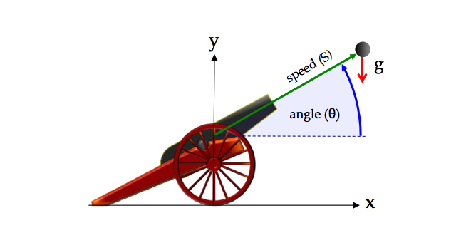

# CITROS CANNON

This is a ROS/CITROS implementation of the [cannonball simulation](https://nasa.github.io/trick/tutorial/ATutASimpleSim) provided by NASA Johnson Space Center as part of the tutorial for the 
[Trick Simulation Environment](https://nasa.github.io/trick/).

It determines the trajectory and time of impact of a cannon ball that is fired with an initial speed and initial angle, assuming a constant acceleration of gravity (g), and no aerodynamic forces.

Two versions of the simulation are provided: an analytic solution and a numeric integration solution.

## Installation

        `git clone git@github.com:citros-garden/citros_cannon.git`
        `cd ~/citros_cannon`
        `code .`
and open the repository inside a container using VScode's *reopen in container* option.

## Build 
        `colcon build`
        `source install/local_setup.bash`

## Run the analytic solution
        `ros2 launch scheduler cannon_analytic.launch.py`

## Run the numeric integration solution
        `ros2 launch scheduler cannon_numeric.launch.py`

## Foxglove
TODO